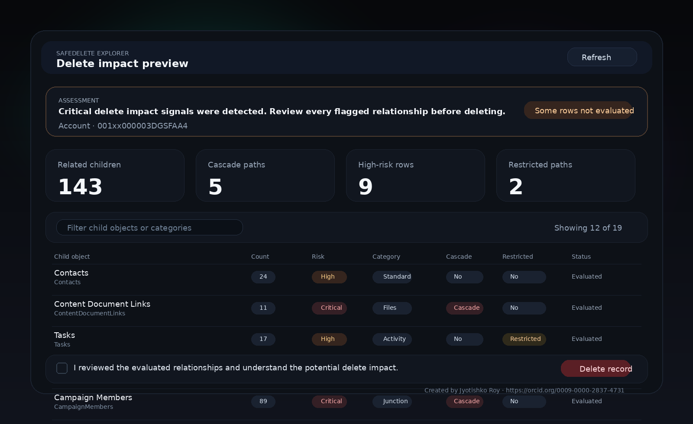

# SafeDelete Explorer

**Repository name:** `safe-delete-explorer`

**One-line description:** Preview the blast radius of record deletion in Salesforce before users click Delete.

SafeDelete Explorer is a native Salesforce DX app that helps admins and power users inspect related records **before** they delete a parent record. It is intentionally lightweight: no custom objects, no flows, no external services, and no mandatory post-install data seeding.

It ships with:

- a Lightning Web Component for record pages, app pages, and utility bar placement
- one Apex service for schema introspection and relationship counting
- optional Custom Metadata rules for noise reduction and high-risk highlighting
- GitHub-ready repository hygiene and open-source documentation



## Why this app exists

Standard delete actions tell users very little about downstream impact. SafeDelete Explorer provides a **preview-first safety layer** by showing:

- child relationships for the current record
- count of related records by child object
- cascade-delete and restricted-delete indicators
- heuristically flagged high-risk relationships such as files, approvals, activities, and junction-style objects
- an optional acknowledgment gate before a delete action is exposed

## Design goals

- **Portable:** deployable to a wide range of Lightning Experience orgs without custom objects
- **Minimal setup:** deploy, grant the permission set, and place the component in Lightning App Builder
- **Safe by default:** preview mode is the default; delete execution is configurable and off by default
- **Readable:** dark visual design, clear badges, summarized risk signals, and low-noise defaults

## What is included

```text
safe-delete-explorer/
├── force-app/
│   └── main/default/
│       ├── classes/
│       ├── customMetadata/
│       ├── lwc/
│       ├── objects/
│       └── permissionsets/
├── manifest/
├── config/
├── docs/
├── CODE_OF_CONDUCT.md
├── CONTRIBUTING.md
├── SECURITY.md
├── CITATION.cff
├── LICENSE
├── NOTICE
└── README.md
```

## Compatibility snapshot

SafeDelete Explorer is built for **Lightning Experience** orgs using supported LWC and Apex metadata patterns. It does not require custom objects, platform events, external APIs, or managed-package namespaces.

Practical compatibility notes:

- supported targets: record page, app page, utility bar
- no object allowlist in the component metadata, so it can be placed on broadly supported record pages
- some child relationships can’t be fully evaluated if the running user lacks access or the child object is not queryable in that org
- orgs with unusually large relationship graphs may see some lower-priority relationships marked as **not evaluated** to stay within Apex governor limits

## Quick start

See [docs/HOW_TO_SETUP.md](docs/HOW_TO_SETUP.md).

## Repository metadata for GitHub

**Suggested repository name**

`safe-delete-explorer`

**Suggested GitHub description**

`A Salesforce DX app that previews child-record blast radius, cascade paths, and high-risk relationships before record deletion.`

**Suggested topics**

`salesforce`, `sfdx`, `apex`, `lwc`, `lightning-web-components`, `metadata-api`, `admin-tools`, `record-safety`, `deletion-preview`

## Author credit

Created by **Jyotishko Roy**  
ORCID: https://orcid.org/0009-0000-2837-4731

The UI includes public authorship credit in the component footer.

## License

Licensed under the Apache License, Version 2.0. See [LICENSE](LICENSE) and [NOTICE](NOTICE).

## Notes on ownership and licensing

This repository attributes authorship and copyright to **Jyotishko Roy** for the included original code and documentation. Open-source licensing governs the copyrightable code and documentation in this repository; it does not create ownership rights over abstract ideas outside the scope of copyright law.
